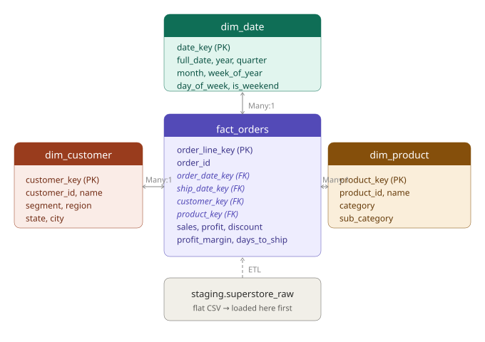

# BI Migration & Dashboard Development
**Dataset:** [Superstore Sales](https://community.tableau.com/s/question/0D54T00000CWeX8SAL/sample-superstore-sales-excelxls) — 9,994 line items, 5,009 orders, 793 customers, Jan 2014–Dec 2017

---

## What this project does

Audited three Tableau dashboards built on the Superstore dataset, identified inconsistencies in how KPIs were defined across workbooks, and migrated everything to Power BI with a proper star schema underneath. The goal was to reduce BI technical debt and get all reports onto a single consistent definition rather than having each workbook compute things independently.

---

## Inconsistencies found in the original dashboards

1. **Profit margin calculation** — 41% of orders (2,077 out of 5,009) produce different margin numbers depending on whether you calculate at order-level (total profit / total sales) or line-item level (average of individual line margins). Different workbooks were using different methods, so the same order could show a different margin depending on which dashboard you opened.

2. **No date spine** — date filtering relied on `DATETRUNC` inline, which caused cross-workbook comparisons to break at quarter boundaries when filters didn't align exactly.

3. **Flat schema** — all three workbooks pointed at the same flat CSV. Any field rename or schema change meant updating three workbooks manually.

4. **Discount bucketing inconsistency** — the discount logic wasn't standardized, so the breakdown of discounted vs non-discounted orders looked different across dashboards.

5. **No documentation** — all transformation logic lived inside Tableau calculated fields, invisible to anyone not actively inside the workbook.

---

## What was built

**Audit notebook (`Superstore_Dashboard_Audit.ipynb`):**
- Loads the raw Superstore data and documents the inconsistencies — the profit margin discrepancy across 41% of orders and the discount bucketing issue. This analysis justified the migration decisions.

**SQL layer (`sql/`):**
- `01_create_tables.sql` — star schema: fact_orders + dim_date + dim_customer + dim_product
- `02_transform_load.sql` — ETL from staging into the star schema, with row count and sum reconciliation checks
- `03_kpi_queries.sql` — seven analytical views that Power BI imports

**DAX layer (`dax/`):**
- `measures.md` — all Power BI measures with equivalent Tableau calculations noted

**Data model (`data_model/`):**
- `schema_documentation.md` — relationship table, field dictionary, Power Query load steps
- `star_schema.svg` — visual schema diagram

---

## Data model



---

## Repo structure

```
bi-migration-dashboard/
├── Superstore_Dashboard_Audit.ipynb   # audit that identified the inconsistencies
├── sql/
│   ├── 01_create_tables.sql
│   ├── 02_transform_load.sql
│   └── 03_kpi_queries.sql
├── dax/
│   └── measures.md
├── data_model/
│   ├── schema_documentation.md
│   └── star_schema.svg
└── README.md
```

---

## How to run

**Load the data:**
1. Download `Sample - Superstore.xls` from Tableau Public
2. Load the Orders sheet into PostgreSQL as `staging.superstore_raw`
3. Run `01_create_tables.sql` then `02_transform_load.sql`
4. Verify using the reconciliation queries at the bottom of `02_transform_load.sql`

**Connect Power BI:**
1. Get Data → PostgreSQL → connect to `analytics` schema
2. Load the seven views from `03_kpi_queries.sql`
3. Set up relationships per `data_model/schema_documentation.md`
4. Add DAX measures from `dax/measures.md`

---

## KPIs delivered

| View | KPI | Notes |
|------|-----|-------|
| `v_monthly_revenue` | Revenue trend | Margin %, order count, units sold |
| `v_regional_sales` | Regional distribution | State-level, margin by region |
| `v_product_performance` | Product-level sales | Category, sub-category, avg discount |
| `v_segment_analysis` | Customer segments | AOV, orders per customer |
| `v_shipping_performance` | Shipping SLA | Avg days to ship, on-time rate |
| `v_yoy_comparison` | Year-over-year growth | Month-level using window function |
| `v_discount_impact` | Discount analysis | Standardized bucketing across all reports |

---

## Key findings from the audit

- **Profit margin inconsistency** — 41% of orders show different margin numbers depending on calculation method. Fixed by computing it once at load time in SQL.
- **Discounts are heavily loss-making** — orders with 20-30% discounts run at -10.0% average margin. Orders with 30%+ discounts average -48.2% margin vs +29.5% for undiscounted orders.
- **Discount bucketing** — standardized into a single SQL view so the breakdown is consistent across all reports.
- **48% of line items have no discount** — the other 52% are discounted. Most common is 20% discount (3,657 rows), which still runs at positive margin (+11.6%). Loss-making territory starts at the 20-30% bucket.

---

## Migration decisions

- Star schema instead of flat CSV — profit_margin and days_to_ship computed once at load, consistent everywhere
- Date dimension enables proper DAX time intelligence (MTD, YTD, SAMEPERIODLASTYEAR) without inline DATETRUNC
- Surrogate keys decouple the fact table from natural keys
- Standardized discount bucketing in `v_discount_impact` — same logic across all reports

---

## Tech stack

| Layer | Tools |
|-------|-------|
| Raw data | Superstore XLS (Tableau sample dataset) |
| Transformation | SQL (PostgreSQL; Snowflake-compatible) |
| Schema pattern | Star schema (1 fact, 3 dims) |
| BI platform | Power BI Desktop |
| Measures | DAX |
| Data loading | Power Query (M) |
